# Diagrama de Arquitectura Cloud - Plataforma VOD

## Arquitectura General del Sistema

```mermaid
graph TB
    %% Usuarios y Dispositivos
    Users[👥 Usuarios Globales] --> CDN[🌐 CloudFront CDN]
    
    %% Capa de Distribución de Contenido
    CDN --> ALB[⚖️ Application Load Balancer]
    
    %% Capa de Aplicación
    ALB --> ECS[🐳 ECS Fargate Cluster]
    ALB --> Lambda[⚡ Lambda Functions]
    
    %% Microservicios en ECS
    ECS --> Auth[🔐 Auth Service]
    ECS --> Catalog[📺 Catalog Service]
    ECS --> Streaming[🎬 Streaming Service]
    ECS --> UserMgmt[👤 User Management]
    ECS --> Analytics[📊 Analytics Service]
    
    %% Funciones Lambda para tareas específicas
    Lambda --> ThumbnailGen[🖼️ Thumbnail Generator]
    Lambda --> VideoProcessing[🎥 Video Processing]
    Lambda --> Notifications[📧 Notifications]
    
    %% Capa de Almacenamiento
    Catalog --> S3Ingesta[(🗄️ S3 Ingesta)]
    Streaming --> S3Videos[(🗄️ S3 Videos)]
    ThumbnailGen --> S3Videos
    VideoProcessing --> S3Ingesta
    
    %% Procesamiento Multimedia
    VideoProcessing --> MediaConvert[🎬 AWS MediaConvert]
    MediaConvert --> S3Videos
    MediaConvert --> SQS[📨 Amazon SQS]
    
    %% Base de Datos
    Auth --> Aurora[(🗃️ Aurora PostgreSQL)]
    Catalog --> Aurora
    UserMgmt --> Aurora
    Analytics --> Aurora
    
    %% Búsqueda y Cache
    Catalog --> OpenSearch[(🔍 OpenSearch)]
    Analytics --> OpenSearch
    
    %% Cache y Sesiones
    Auth --> ElastiCache[(⚡ Redis ElastiCache)]
    UserMgmt --> ElastiCache
    
    %% Monitoreo y Logging
    CloudWatch[📊 CloudWatch] --> ECS
    CloudWatch --> Lambda
    CloudWatch --> RDS
    XRay[🔍 X-Ray Tracing] --> ECS
    XRay --> Lambda
    
    %% Seguridad
    WAF[🛡️ AWS WAF] --> ALB
    IAM[🔑 IAM Roles] --> ECS
    IAM --> Lambda
    IAM --> Aurora
    KMS[🔐 KMS] --> S3Ingesta
    KMS --> S3Videos
    KMS --> Aurora
    
    %% Networking
    VPC[🌐 VPC] --> ECS
    VPC --> RDS
    VPC --> ElastiCache
    VPC --> Lambda
    
    %% CI/CD Pipeline
    GitHub[📚 GitHub Repository] --> Actions[⚙️ GitHub Actions]
    Actions --> ECR[🐳 Amazon ECR]
    ECR --> ECS
    
    %% Estilos
    classDef aws fill:#FF9900,stroke:#232F3E,stroke-width:2px,color:#fff
    classDef service fill:#4CAF50,stroke:#2E7D32,stroke-width:2px,color:#fff
    classDef storage fill:#2196F3,stroke:#1976D2,stroke-width:2px,color:#fff
    classDef security fill:#F44336,stroke:#D32F2F,stroke-width:2px,color:#fff
    classDef monitoring fill:#9C27B0,stroke:#7B1FA2,stroke-width:2px,color:#fff
    
    class CDN,ALB,ECS,Lambda,S3Ingesta,S3Videos,Aurora,OpenSearch,ElastiCache,ECR,MediaConvert,SQS aws
    class Auth,Catalog,Streaming,UserMgmt,Analytics,ThumbnailGen,VideoProcessing,Notifications service
    class S3Ingesta,S3Videos,Aurora,OpenSearch,ElastiCache storage
    class WAF,IAM,KMS security
    class CloudWatch,XRay monitoring
```

## Arquitectura de Red y Seguridad

```mermaid
graph TB
    %% Internet Gateway
    Internet[🌐 Internet] --> IGW[🌐 Internet Gateway]
    
    %% VPC y Subnets
    IGW --> VPC[🏗️ VPC: 10.0.0.0/16]
    
    VPC --> PublicSubnet1[🌐 Public Subnet 1<br/>10.0.1.0/24<br/>AZ: us-east-1a]
    VPC --> PublicSubnet2[🌐 Public Subnet 2<br/>10.0.2.0/24<br/>AZ: us-east-1b]
    
    VPC --> PrivateSubnet1[🔒 Private Subnet 1<br/>10.0.3.0/24<br/>AZ: us-east-1a]
    VPC --> PrivateSubnet2[🔒 Private Subnet 2<br/>10.0.4.0/24<br/>AZ: us-east-1b]
    
    VPC --> DataSubnet1[🗄️ Data Subnet 1<br/>10.0.5.0/24<br/>AZ: us-east-1a]
    VPC --> DataSubnet2[🗄️ Data Subnet 2<br/>10.0.6.0/24<br/>AZ: us-east-1b]
    
    %% Componentes en Subnets Públicas
    PublicSubnet1 --> ALB[⚖️ Application Load Balancer]
    PublicSubnet2 --> ALB
    
    %% Componentes en Subnets Privadas
    PrivateSubnet1 --> ECS1[🐳 ECS Fargate 1]
    PrivateSubnet2 --> ECS2[🐳 ECS Fargate 2]
    
    %% Componentes en Subnets de Datos
    DataSubnet1 --> Aurora1[(🗃️ Aurora Primary)]
    DataSubnet2 --> Aurora2[(🗃️ Aurora Read Replica)]
    DataSubnet1 --> OpenSearch1[(🔍 OpenSearch Primary)]
    DataSubnet2 --> OpenSearch2[(🔍 OpenSearch Replica)]
    DataSubnet1 --> ElastiCache1[(⚡ Redis Primary)]
    DataSubnet2 --> ElastiCache2[(⚡ Redis Replica)]
    
    %% NAT Gateway para acceso a internet desde subnets privadas
    PublicSubnet1 --> NAT[🌐 NAT Gateway]
    NAT --> PrivateSubnet1
    NAT --> PrivateSubnet2
    
    %% Security Groups
    ALB --> SG_ALB[🛡️ Security Group ALB<br/>Ports: 80, 443]
    ECS1 --> SG_ECS[🛡️ Security Group ECS<br/>Ports: 8080]
    Aurora1 --> SG_Aurora[🛡️ Security Group Aurora<br/>Ports: 5432]
    OpenSearch1 --> SG_OpenSearch[🛡️ Security Group OpenSearch<br/>Ports: 443]
    ElastiCache1 --> SG_Cache[🛡️ Security Group Cache<br/>Ports: 6379]
    
    %% Estilos
    classDef public fill:#4CAF50,stroke:#2E7D32,stroke-width:2px,color:#fff
    classDef private fill:#FF9800,stroke:#F57C00,stroke-width:2px,color:#fff
    classDef data fill:#2196F3,stroke:#1976D2,stroke-width:2px,color:#fff
    classDef security fill:#F44336,stroke:#D32F2F,stroke-width:2px,color:#fff
    
    class PublicSubnet1,PublicSubnet2,ALB,IGW,NAT public
    class PrivateSubnet1,PrivateSubnet2,ECS1,ECS2 private
    class DataSubnet1,DataSubnet2,Aurora1,Aurora2,OpenSearch1,OpenSearch2,ElastiCache1,ElastiCache2 data
    class SG_ALB,SG_ECS,SG_Aurora,SG_OpenSearch,SG_Cache security
```

## Pipeline de CI/CD

## Flujo de Datos del Usuario

```mermaid
sequenceDiagram
    participant U as Usuario
    participant CDN as CloudFront
    participant ALB as Load Balancer
    participant ECS as ECS Service
    participant Cache as Redis Cache
    participant DB as PostgreSQL
    participant S3 as S3 Storage
    
    U->>CDN: Solicita contenido
    CDN->>ALB: Ruta a la aplicación
    ALB->>ECS: Balancea la carga
    
    ECS->>Cache: Verifica cache
    alt Datos en cache
        Cache-->>ECS: Retorna datos
    else Datos no en cache
        ECS->>DB: Consulta base de datos
        DB-->>ECS: Retorna datos
        ECS->>Cache: Almacena en cache
    end
    
    ECS->>S3: Obtiene archivos multimedia
    S3-->>ECS: Retorna archivos
    ECS-->>ALB: Respuesta de la aplicación
    ALB-->>CDN: Respuesta balanceada
    CDN-->>U: Contenido entregado
```

## Componentes de Escalabilidad

```mermaid
graph TB
    %% Auto Scaling
    ASG[📈 Auto Scaling Group] --> ECS[🐳 ECS Fargate]
    
    %% Métricas de escalado
    CPU[💻 CPU Utilization] --> ASG
    Memory[🧠 Memory Usage] --> ASG
    Requests[📊 Request Count] --> ASG
    
    %% Load Balancing
    ALB[⚖️ Application Load Balancer] --> ECS
    ALB --> HealthCheck[🏥 Health Checks]
    
    %% Base de Datos
    Aurora[(🗃️ Aurora Multi-AZ)] --> ReadReplicas[(📖 Read Replicas)]
    OpenSearch[(🔍 OpenSearch Cluster)] --> DataNodes[📊 Data Nodes]
    
    %% Cache Distribuido
    ElastiCache[(⚡ Redis Cluster)] --> Shards[🔀 Shards]
    
    %% Almacenamiento
    S3Ingesta[(🗄️ S3 Ingesta)] --> S3Videos[(🗄️ S3 Videos)]
    S3Videos --> S3IA[(🗄️ S3 IA)]
    S3IA --> Glacier[(🗄️ Glacier)]
    
    %% CDN Global
    CloudFront[🌐 CloudFront] --> EdgeLocations[📍 Edge Locations]
    
    %% Estilos
    classDef scaling fill:#4CAF50,stroke:#2E7D32,stroke-width:2px,color:#fff
    classDef storage fill:#2196F3,stroke:#1976D2,stroke-width:2px,color:#fff
    classDef monitoring fill:#FF9800,stroke:#F57C00,stroke-width:2px,color:#fff
    
    class ASG,ECS,ALB,HealthCheck scaling
    class Aurora,ReadReplicas,OpenSearch,DataNodes,ElastiCache,Shards,S3Ingesta,S3Videos,S3IA,Glacier,CloudFront,EdgeLocations storage
    class CPU,Memory,Requests monitoring
```

## Flujo de Procesamiento Multimedia

```mermaid
graph LR
    %% Usuario sube video
    User[👤 Usuario] --> Upload[📤 Upload Video]
    Upload --> S3Ingesta[(🗄️ S3 Ingesta)]
    
    %% Procesamiento asíncrono
    S3Ingesta --> SQS[📨 SQS Queue]
    SQS --> Lambda[⚡ Lambda Function]
    Lambda --> MediaConvert[🎬 MediaConvert]
    
    %% Transcodificación
    MediaConvert --> Process[🔄 Transcodificar]
    Process --> HLS[📺 HLS Format]
    Process --> DASH[📺 DASH Format]
    
    %% Almacenamiento final
    HLS --> S3Videos[(🗄️ S3 Videos)]
    DASH --> S3Videos
    
    %% Distribución
    S3Videos --> CloudFront[🌐 CloudFront CDN]
    CloudFront --> User[👤 Usuario]
    
    %% Estilos
    classDef user fill:#4CAF50,stroke:#2E7D32,stroke-width:2px,color:#fff
    classDef storage fill:#2196F3,stroke:#1976D2,stroke-width:2px,color:#fff
    classDef processing fill:#FF9800,stroke:#F57C00,stroke-width:2px,color:#fff
    classDef distribution fill:#9C27B0,stroke:#7B1FA2,stroke-width:2px,color:#fff
    
    class User,Upload user
    class S3Ingesta,S3Videos storage
    class SQS,Lambda,MediaConvert,Process,HLS,DASH processing
    class CloudFront distribution
```

